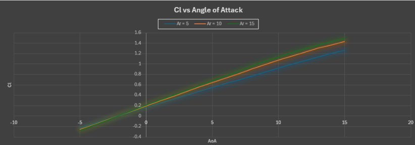
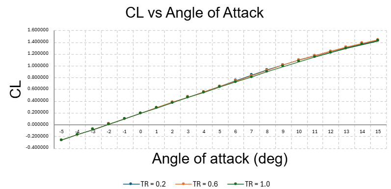
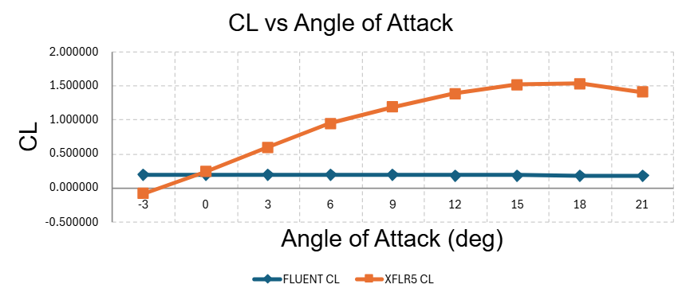

# ✈️ Aerodynamic Analysis of Wings and Airfoils

**Course:** EAS 3101 – Fundamentals of Aerodynamics, University of Central Florida
**Team:** Blake Paoli, Jacob Quirindongo & Dominick De La Torre
**Due:** August 1, 2026

Comparative aerodynamic study of wing geometry effects using lifting-line theory in XFLR5, with a bonus CFD validation against ANSYS Fluent.

🎥 **Videos:**
- [Part A — Aspect Ratio Study](https://youtu.be/1hPLcjjO6WQ)
- [Part B — Taper Ratio Study](https://youtu.be/HTDpyH3U5Is)
- [Part C (Bonus) — Fluent CFD Validation](https://youtu.be/cprLUsbtQPc)

---

## Part A — Aspect Ratio Study

Three rectangular wings (NACA 2415 airfoil, no twist/dihedral, 1 m chord) were modeled in XFLR5 at 50 m/s using lifting-line theory, sweeping angle of attack from −5° to 15°:

| Wing | Aspect Ratio |
|---|---|
| 1a | 5 |
| 2a | 10 |
| 3a | 15 |

**At 5° angle of attack:**

| | AR = 5 | AR = 10 | AR = 15 |
|---|---|---|---|
| Total C_L | 0.549 | 0.642 | 0.682 |
| Oswald efficiency (e) | 0.967 | 0.927 | 0.894 |
| Induced angle of attack | 2.00° | 1.17° | 0.83° |
| Induced C_D | 0.0198 | 0.0142 | 0.0110 |

**Lift curve slope** (XFLR5 vs. theoretical, per lecture equations) showed close agreement, with error increasing slightly at higher aspect ratio — 4.3% (AR 5), 5.9% (AR 10), and 6.5% (AR 15).

### Findings
Higher aspect ratio wings produced less induced drag and a better lift-to-drag ratio — the AR 15 wing was the most aerodynamically efficient, while AR 5 generated the most drag. However, a very high aspect ratio isn't automatically the best choice: longer wings are heavier, harder to manufacture, and see more bending moment at the root. **AR 10 was identified as the best balance** of aerodynamic performance and structural practicality.

---

## Part B — Taper Ratio Study

Three tapered wings (AR = 10, NACA 2415, 1 m root chord) were analyzed the same way:

| Wing | Taper Ratio |
|---|---|
| 1b | 0.2 |
| 2b | 0.6 |
| 3b | 1.0 (rectangular baseline) |

**Lift curve slope**, XFLR5 vs. theoretical — agreement was much tighter here than in Part A, within ~2% across all three taper ratios.

**At 5° angle of attack:**

| | TR = 0.2 | TR = 0.6 | TR = 1.0 |
|---|---|---|---|
| Total C_L | 0.651 | 0.653 | 0.648 |
| Oswald efficiency (e) | 0.975 | **0.977** | 0.927 |
| Induced C_D | 0.0138 | 0.0139 | 0.0144 |

### Findings
Tapered wings (TR 0.6 and 0.2) produced slightly more lift and less induced drag than the rectangular baseline, with better Oswald efficiency — their lift distribution sat closer to the ideal elliptical shape. The TR 0.2 wing performed well numerically, but its very narrow tip raises manufacturability concerns and could cause less predictable stall behavior. **TR 0.6 delivered comparable performance without that narrow-tip drawback.**

---

## Part C — Design Recommendation

**Selected design: AR 10, TR 0.6** — chosen as the best balance of lift, drag, efficiency, and manufacturability for a low-speed airplane application.

- At 5° AoA: C_L ≈ 0.653, induced C_D ≈ 0.0139, Oswald efficiency ≈ 0.977 (the highest among all taper ratios tested)
- More efficient than AR 5 (lower induced drag) and more practical than AR 15 (shorter span, less structural demand)
- The wider tip versus the TR 0.2 design supports easier manufacturing and better handling near stall — relevant during low-speed takeoff and landing

---

## 🔬 Bonus — CFD Validation in ANSYS Fluent

NACA 2415 airfoil, Re = 1,000,000, α from −3° to +21° (3° increments). Fluent-computed C_L, C_D, and C_L/C_D were plotted directly against XFLR5 results, with velocity/pressure contours captured at 0° and 10° AoA.

### Result — and an honest discrepancy
XFLR5 produced the expected lift curve: C_L rising from ~0.24 near 0° to a peak of ~1.53 around 18° before dropping off (stall behavior). **Fluent's C_L stayed nearly flat across the entire sweep (~0.17–0.19), showing almost no sensitivity to angle of attack.** This is not physically realistic for an airfoil across that AoA range and points to a likely issue in the Fluent setup — possibilities include insufficient mesh refinement near the leading edge, incomplete convergence, or a boundary condition/reference value error rather than a real aerodynamic effect. Rather than paper over it, this is flagged here as a limitation and a lesson in cross-validating CFD output against a lower-order method before trusting it.

---

## 🛠️ Tools Used
`XFLR5` `ANSYS Fluent` `Microsoft Excel`

## 📁 Repo Contents
- `Rectangular_wing_-_AR_5_10_15_Excel_Data.pdf` — Part A raw data and analysis
- `Tapered_Wing_-_AR_5_10_15_Excel_Data.pdf` — Part B raw data and analysis
- `Wing_Aspect_Ratio_Charts_and_Discussion.pdf` — Part A/B charts and Part C discussion
- `ANSYS_Fluent_Wing_Data.pdf` — Bonus Fluent vs. XFLR5 validation
- `images/` — comparison charts and Fluent contour screenshots
